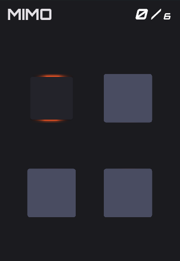
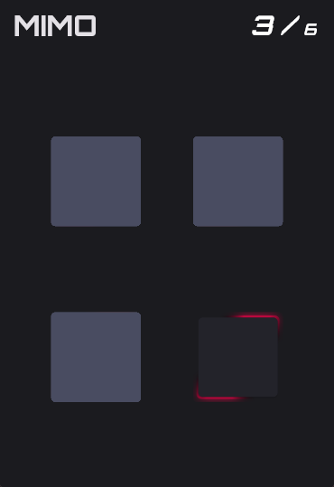
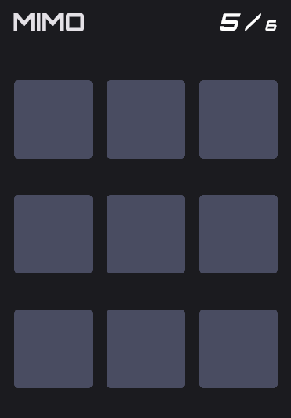

<div align="center">
    
    <h1>MOSFET</h1>
    <p>A Memory Game</p>
</div>

---

## Screenshots
<p align="center">
  
  
  
</p>


## ToDo
- [ ] Add more theme
- [ ] Better sound effects
- [ ] More animations


## Build
```bash
git clone https://github.com/empitrix/mimo
cd ./mimo
flutter create .
```

